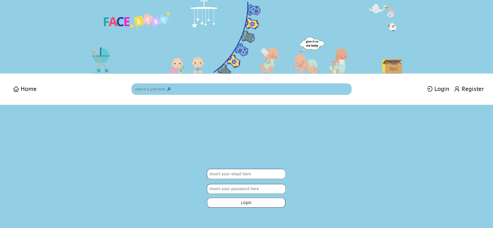
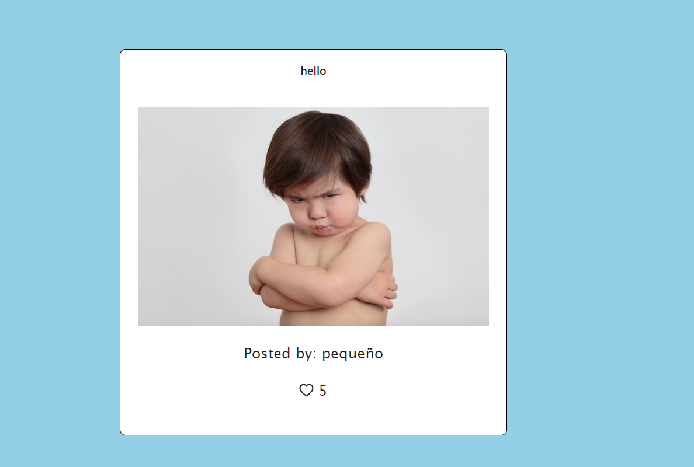

<h1 align="center"> FULL STACK PROJECT  </h1> 
<h4 align="center"> SOCIAL NETWORK (FaceBaby) </h4>
<h4 align="center">with Node, MongoDB & React.JS.</h4>

 <p align="center">
    Social network using MongoDB in the Back-End and React.JS for the Front-End.
    <br />
    <a href="https://github.com/victorcodigos/Face_baby"><strong>Explore the docs »</strong></a>
    <br />
    ·
    <a href="https://github.com/victorcodigos/Face_baby/issues">Report Bug</a>
    ·
    <a href="https://github.com/victorcodigos/Face_baby/issues">Request Feature</a>
  </p>
</div>

 <p align="center">
Welcome to our website, our babys are lovely!</p>

<h4 align="center"> FaceBaby is the new social network for babys, enjoy! better than other social network :D Here you will find cutes babys. FaceBaby is a social network of pictures and videos created by Victor Macedo and Adrian Pastor in 2023, in the app you can apply filters and search for others users!</h4>
 

## <h1 align="center"> 🧑‍💻 Description | Development 👩‍💻 </h1>


 Back-End developed in JavaScript, using Express, Mongosh and Mongoose for solid integration with a MongoDB database. Bcrypt and JSON Web Token to ensure the security of user data. Also, use Nodemailer to confirm emails and recover password. We also use the Multer to be able to send a photo from the body.
 Front-End developed with JavaScript, we use React.JS as a framework.


## *Functions* - IN THE FRONT-END


**Posts** 🌃
You can create a post when you are logged in the app.
--
**Users** 👥
You can give follow and unffollow in all users.
--
**Likes** 👍
You can give a like and also disliked in the posts!
--
**Comments** 🧑‍💻
You can write some commentary in the post!
--
**Register** 📩
You can register an user and will be salving it in the data base.
--
**Login** 💥
You can login using bcrypt password.
--

## *Endpoints* - IN THE BACK-END 

<a href="https://github.com/apl09/Social_Network">We are using this Back-End</a>

CRUD (Create, Read, Update, Delete).

### Posts

- `POST /api/posts`: Endpoint for creating a post (authentication required).
- `PUT /api/posts/:id`: Endpoint for updating a post (authentication required).
- `DELETE /api/posts/:id`: Endpoint for deleting a post (authentication required).
- `GET /api/posts`: Endpoint for fetching all posts along with their authors and comments.
- `GET /api/posts/search:name`: Endpoint for searching posts by name.
- `GET /api/posts/:id`: Endpoint for fetching a specific post by ID.
- Validation is implemented while creating a post to ensure all fields are filled (except the image, which is optional).

### Likes

- `POST /api/posts/:id/like`: Endpoint for liking a specific post (authentication required).
- `DELETE /api/posts/:id/like`: Endpoint for unliking a specific post (authentication required).
- Users can unlike a post without having liked it before.
- Only one Like per user is allowed for each post.

### Comments

- `POST /api/posts/:id/comment`: Endpoint for creating a comment on a specific post (authentication required).

### Users

- `POST /api/users/register`: Endpoint for registering a user using bcrypt for secure password storage.
- `POST /api/users/login`: Endpoint for user login using bcrypt + JWT.
- `GET /api/users/me`: Endpoint for fetching information about the currently logged-in user.
- `POST /api/users/logout`: Endpoint for user logout.
- Validation is implemented while creating a user to ensure all fields are filled.


<h1 align="center"> LOGIN VIEW </h1>

<h1>
   </img>
  
  </h1> 


### Challenge 🎢 & Skills Achieved

- User registration using Bcrypt.
- User login + token + middleware.
- Implementing CRUD operations.
- Validations.
- Using Multer to send images.
- Using nodemailer to send confimation email and recover password.
- In the Front-End all the funcions are working very well with clean code!


### Technologies | Tools : 


 


## Deployment THIS PROJECT 🚀 :


To deploy the project:

```bash

  npm run deploy


```
## Dependencies:

```bash

 "dependencies": {
    "@reduxjs/toolkit": "^1.9.5",
    "antd": "^5.8.6",
    "axios": "^1.5.0",
    "react": "^18.2.0",
    "react-dom": "^18.2.0",
    "react-icons": "^4.11.0",
    "react-redux": "^8.1.2",
    "react-router-dom": "^6.15.0",
    "sass": "^1.66.1"
  },

  ```
 <h1 align="center"> POST VIEW </h1>

  <h1>
   </img>
  
  </h1> 

## Working with branches 🎯

Project Full Stack using the MERN stack, good to work with branchs because we can learn more! It was gratifying to see everything working very well :D


  ## Future Roadmap
- [ ] Update a commentary and also like on it.
- [ ] Add new things (Carrousel and others.)
- [ ] Add a photo in the profile view.
- [ ] Add a different style
- [ ] Add more users
- [ ] Add reviews
- [ ] Swagger 


## Contributing

Contributions are what make the open source community such an amazing place to learn, inspire, and create. Any contributions you make are **greatly appreciated**.

If you have a suggestion that would make this better, please fork the repo and create a pull request. You can also simply open an issue with the tag "enhancement".
Don't forget to give the project a star! Thanks again!

1. Fork the project
2. Create your feature Branch (`git checkout -b feature/YourName`)
3. Commit your changes (`git commit -m 'Add some YourName`)
4. Push to the branch (`git push origin feature/YourName`)
5. Open a pull request.

# Project made by Victor Macedo and Adrian Pastor.

### 📫 How to reach us:

<a href="https://www.linkedin.com/in/victor-macedo-4a8901210/" target="_blank"> Victor Macedo </a>

<a href="https://www.linkedin.com/in/adrian-pastor-lopez-/" target="_blank"> Adrian Pastor </a> 

<a href="https://github.com/victorcodigos" target="_blank">Victor Macedo</a>


<a href="https://github.com/apl09" target="_blank">Adrian Pastor</a>
